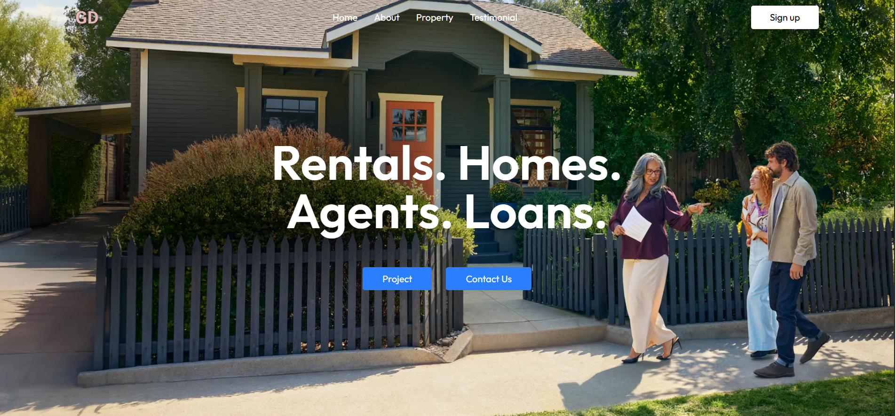
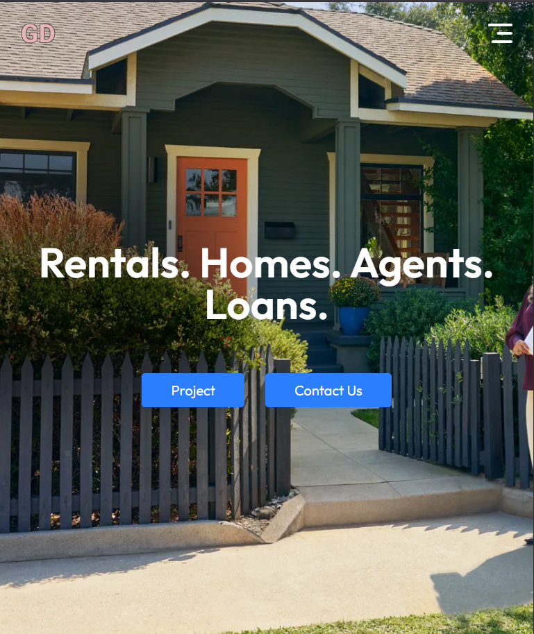
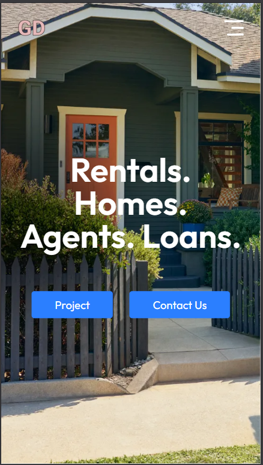

# Real Estate React Application

## Overview
This is a responsive real estate web application built with React. It showcases rental properties, homes, agents, and loan services through an interactive and visually appealing interface. The app includes project portfolios, client testimonials, and a contact form for user engagement.

## Features
- React-based single-page application (SPA) architecture
- Dynamic navigation with smooth scrolling to different sections
- Hero section with background image and key tagline
- About section highlighting brand experience and achievements
- Projects section displaying real estate listings with images, prices, and locations
- Testimonials showcasing client feedback with star ratings and profile images
- Contact form for submitting inquiries with form validation
- Responsive design for seamless experience across desktop and mobile devices

## Responsive
### Desktop

### Tab

### Mobile

## Technologies Used
- React.js for UI components and state management
- CSS (Tailwind CSS utility-first framework) for styling and layout
- React hooks for component lifecycle and form handling
- Accessibility features including ARIA attributes for notifications
- Responsive flexbox and grid layouts

## Live preview
[Live Preview](https://galaxy-door.vercel.app)

## Installation
1. Clone the repository:
     - git clone https://github.com/yourusername/real-estate-react-app.git

2. Navigate to the project directory:
    - cd real-estate-react-app
3. Install dependencies:
    - npm install

4. Start the development server:
    - npm run dev

5. Open your browser and go to `http://localhost:3000` to view the app.

## Usage
- Use the navigation menu to explore Home, About, Projects, Testimonials, and Contact sections.
- Browse through featured projects and view details like price and location.
- Read client testimonials for trust and authenticity.
- Submit questions and inquiries via the Contact Us form.

## Future Improvements
- Add backend API integration for dynamic data fetching and form submissions
- Implement state management with Redux or Context API for complex state
- Add authentication for user-specific features
- Include unit and integration testing with Jest and React Testing Library
- Optimize performance and SEO for better visibility

## Author
Sumit Sharma

## License
© 2024 Sumit Sharma. All rights reserved.

---

Feel free to contribute or raise issues if you want to improve the project.

